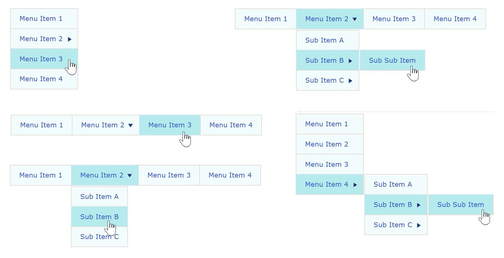

## Ext Menu Reloaded
+ A Joomla 4.x/5.x migration (and Joomla 3.x update) for the [Joomla](https://www.joomla.org/) module "ARI Ext Menu"
+ "Ext Menu Reloaded" is a fork of the "ARI Ext Menu" module [(version 2.2.12)](https://www.ari-soft.com/index.php?dl=mod_ariextmenu.zip&f=603102c6915804e7805d227a8c181ff8&t=1701535070&option=com_arismartcontent&task=plugin_handler&handler=a4197fefd329010736ae3073855be045), which was developed by [ARI Soft](https://www.ari-soft.com)
+ The fork intends to make the functionality of the former "ARI Ext Menu" module available for Joomla 4 and 5, because the original module is not provided and supported any more
+ Support for the Joomla update system was added to check and install new releases of the plugin
+ **The code was migrated to the Joomla 4.x and 5.x CMS and module API**
+ The latest 5.0.x release can be used for **Joomla 5.x** and **Joomla 4.x**. Joomla 5 can be used without Compatibility plugin.
+ Earlier patch releases can be used for **Joomla 3.10** and **PHP 8**.

The following aspects of the PHP code were changed or refactured:
+ PHP 8
    + Substitution of curly braces for character access in arrays (i.e. "my_array[0]" instead of "my_array{0}")
    + Declaration of static methods as static (i.e. "static function" instead of "function" only)
+ Joomla 4.x
    + Adaptions to Joomla 4.x CMS and module API
	+ Updated XML file for Joomla 4 installation
	+ Added "defined('_JEXEC') or die()" code to several PHP files
+ Joomla 5.x
    + Major refactoring for Joomla 5 CMS and module API
    + Can be used in Joomla 5 without activating the Compatibility plugin
    + Support of Joomla update system. Joomla will automatically check for updates in the administration backend.

##  Screenshots

##  Installation
+ Joomla 4.x/5.x and PHP 8
    + Manual installation
        + Download the [latest release](https://github.com/Jefferson49/Joomla_module_ext_menu_reloaded/releases/latest) of the module
        + Install the ZIP package in the Joomla administration backend
    + If you want to reuse data from the former ARI Ext Menu, do not uninstall the former ARI Ext Menu module. Instead, just install the Ext Menu Reloaded module. It will re-use the existing database tables.
    + Joomla update system
        + Prerequesite: first installation has to be installed manually, see above
        + Joomla will automatically check for updates in the administration backend
        + If an update is available, change to the Extensions / Update menu and install the update 
+ Joomla 3.x and PHP 8 patches
    + Download [release v1.0.0](https://github.com/Jefferson49/Joomla_module_ext_menu_reloaded/releases/tag/v1.0.0)
    + Unzip the file to a local directory and copy the folder "mod_ariextmenu" into the "modules" folder of your Joomla installation
    + Please note that **release v1.0.0 only contain a patched subset of the module files**
    + If you want to install the complete module from scratch, you need to install the ARI Ext Menu module first and apply the patch afterwards.

##  Versions: Joomla, PHP, ARI Ext Menu 
+ The latest version v5.0.x was developed and tested with: 
    + [Joomla 5.0.1](https://downloads.joomla.org/cms/joomla5) and [Joomla 4.4.1](https://downloads.joomla.org/cms/joomla4); but should also run with other Joomla 5.x, 4.x versions.
    + PHP 8.2.5; but should also run with other PHP 8.2 versions.
+ The Joomla 3.10 and PHP 8 patches were developed and tested with: 
    + [Joomla 3.10.11](https://downloads.joomla.org/cms/joomla3); but should also run with other Joomla 3.x versions.
    + PHP 8.0.23
    + [ARI Ext Menu 2.2.12](https://www.ari-soft.com/index.php?dl=mod_ariextmenu.zip&f=603102c6915804e7805d227a8c181ff8&t=1701535070&option=com_arismartcontent&task=plugin_handler&handler=a4197fefd329010736ae3073855be045)

## Translation
You can help to translate this module:
+ User frontend translations: [/mod_ariextmenu/install/language](install/language/)

You can use a text editor like notepad++ to work on translations.

You can contribute translations via a pull request (if you know how to do), or by opening a new Github issue and attaching the file. Updated translations will be included in the next release of this module.

Currently, the following frontend languages are available:
+ Arabian
+ English
+ German
+ Slovak
+ Spanish

## Issue reporting
If you experience any bugs [create a new issue](https://github.com/Jefferson49/Joomla_module_ext_menu_reloaded/issues) in the Github repository

## License
+ [GNU General Public License, Version 3](LICENSE.md)
+ Joomla
    + Copyright (c) 2005-2024 [Open Source Matters, Inc.](https://www.opensourcematters.org/)
+ ARI Ext Menu (Joomla extension)
    + Copyright (c) 2009-2017 [ARI Soft](https://www.ari-soft.com)
+ Ext Menu Reloaded (Joomla extension)
    + Copyright (c) 2024 [Jefferson49](https://github.com/Jefferson49)

This program is free software: you can redistribute it and/or modify it under the terms of the GNU General Public License as published by the Free Software Foundation, either version 3 of the License, or (at your option) any later version.

This program is distributed in the hope that it will be useful, but WITHOUT ANY WARRANTY; without even the implied warranty of MERCHANTABILITY or FITNESS FOR A PARTICULAR PURPOSE. See the GNU General Public License for more details.

You should have received a copy of the GNU General Public License along with this program. If not, see https://www.gnu.org/licenses/.

## Development and Contributions
+ The module was developed by [ARI Soft](https://www.ari-soft.com) for Joomla 1.x, 2.x, and 3 with the original module name "ARI Ext Menu".
+ A fork of the module was migrated to Joomla 4.x/5.x with the new module name "Ext Menu Reloaded" by [Jefferson49](https://github.com/Jefferson49)
+ Further contributions on [Github](https://github.com/Jefferson49/Joomla_module_ext_menu_reloaded) are welcome!

##  Github repository  
https://github.com/Jefferson49/Joomla_module_ext_menu_reloaded